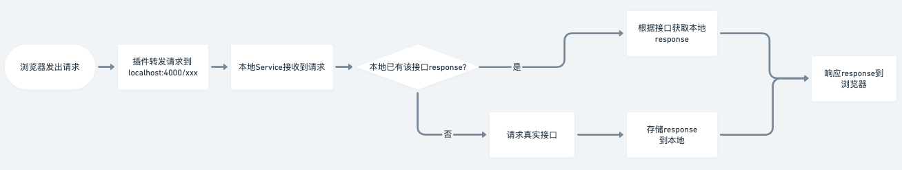

# Proxy & Mock

## Intro

- **chrome插件**： 转发请求到本地Service;
- **本地Service**： 转发http请求到服务器 & 存储接口返回 & 响应浏览器;


## 安装

1. 安装chrome插件：位置：`./Chrome`
2. 开启本地Node Service：
   1. `cd ./Service`
   2. `npm install`
   3. `npm start` 或 `npm run pm2`


## 使用

1. 点击插件icon，打开插件
2. 点右下角 + ，增加需要proxy的url


## 工作流程




## 项目目录


```
.
├── .github               github action
├── Chrome                chrome插件包(可直接安装到浏览器)
├── Proxy                 chrome插件源码
├── Service               本地node.js服务
│   ├── DB                    存储本地数据
│   │   ├── response             response JSON数据
│   │   └── index.js             Record<url，response文件地址>
│   ├── logs                  pm2日志
│   ├── src                   代码
│   └── ...
├── .gitignore
└── README.md

```


## TODO

1. [ ] 将node(Service)服务做成可运行包
2. [ ] 升级chrome extension到v3(解决同步获取cookie的问题)
3. [x] 增加proxy-url支持打tag
4. [x] 更新接口对应的本地response时，现在是会报错“本地没有该文件”， 修改为若没有没有缓存过改接口对应response, 则创建，并响应“本地无该接口对应response ，已创建”
5. [x] 加一个Popup, 展示按钮
   1. [x] 当前proxy list(switch、删除、tag)
   2. [x] 打开tab页
6. [ ] ? MacBook Pro (13-inch, M1, 2020) 版本:11.2.3 => pm2启动，电脑频繁紫屏重启
7. [ ] 两个接口支持使用一份mock-data


