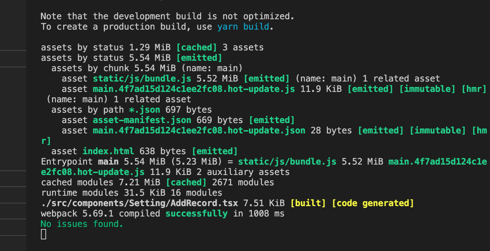

# 性能

内存占用记录

## webpack 热编译速度

## webpack 生产包体积

## vite 热编译
## vite 包体积

# TODO

1. [x] 备忘录功能, 展示在日历上(todo-list)
2. [ ] feature: 一些常用网站入口，每天早晨浏览
   1. [ ] leetcode
   2. [ ] 新闻
   3. [ ] 单词
3. [ ] feature: 专注倒计时
4. [ ] 删除选择时间范围
   1. [ ] 3天前
   2. [ ] 一周前
   3. [ ] 一个月前
   4. [ ] 全部
   5. [ ] 某个日期之前
5. [x] feature: 迁移vite
6. [ ] feature: React.18
7. [x] 列表筛选结果动效

## Question

1. [ ] 为什么打包的时候提醒我安装 `@types/babel__core` ?
